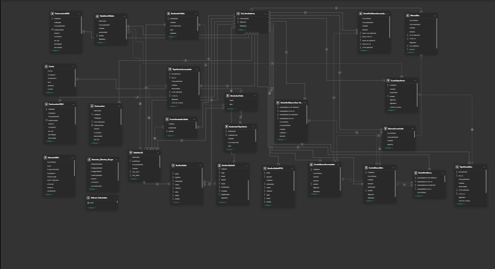
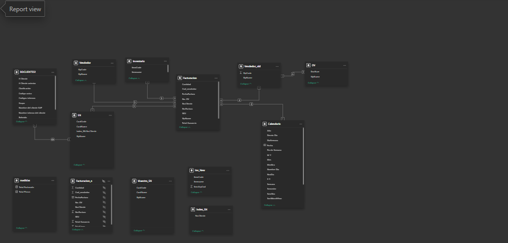
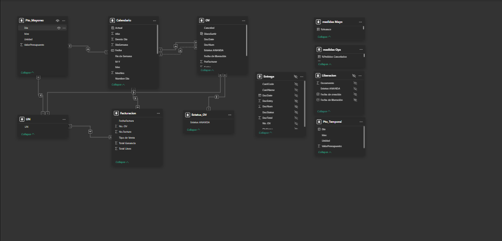

# Análisis de Ventas y Reportes

Este repositorio contiene una colección de archivos Power BI (.pbix) diseñados para el análisis de ventas y generación de reportes para diferentes áreas de negocio.

## Archivos disponibles:

1. **Alineacion.pbix** - Dashboard de alineación estratégica
2. **Analisis de Ventas PE GASG.pbix** - Análisis de ventas para PE GASG
3. **Analisis de Ventas.pbix** - Análisis general de ventas
4. **Aplicacion Ingresos.pbix** - Reporte de aplicación de ingresos
5. **Invoice Report.pbix** - Reporte de facturación
6. **KPI's RALE - PepsiCo.pbix** - Tablero de KPIs para RALE (PepsiCo)
7. **Venta Cartera Mayoreo.pbix** - Reporte de ventas de cartera mayoreo
8. **Venta Mes Cierre.pbix** - Reporte de ventas al cierre del mes
9. **Venta Nuevos Mayoreo.pbix** - Reporte de ventas a nuevos clientes mayoreo

## Tipos de Modelo de Datos:

#### 1. **Complejo**

#### 2. **Estrella**

#### 3. **Copo de Nieve**

## Visualicaciones de Datos:

#### 1. **Complejo**

#### 2. **Estrella**

#### 3. **Copo de Nieve**

## Requisitos:
- Power BI Desktop (versión recomendada: última disponible)
- Acceso a las fuentes de datos correspondientes

## Instrucciones:
1. Descargar el archivo .pbix deseado
2. Abrir con Power BI Desktop
3. Actualizar las conexiones de datos si es necesario
4. Interactuar con los dashboards y reportes